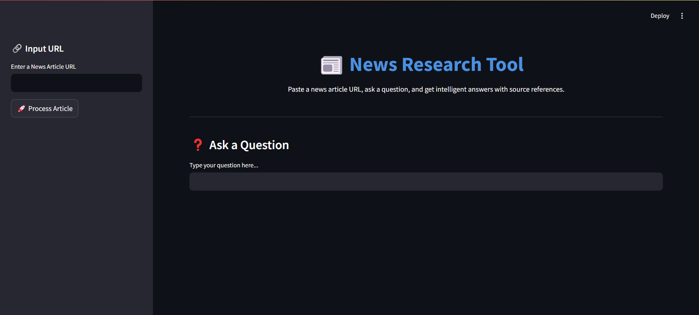

# News Research Tool

A user-friendly app for researching financial and stock market news.  
Just input article URLs and ask questions — get answers with relevant sources in seconds.

---

## 🔧 Features

- Paste or upload text files with URLs to load news content  
- Extracts article text using LangChain’s `UnstructuredURLLoader`  
- Embeds content via OpenAI and indexes using FAISS for fast retrieval  
- Ask questions and get answers with source references  
