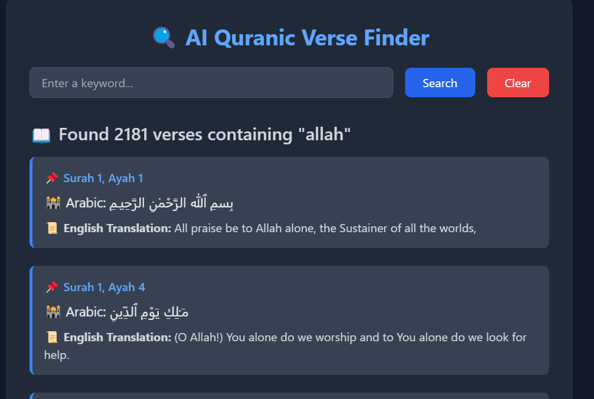

# AI Quranic Verse Finder

This project is an **AI-powered Quranic verse search tool** that allows users to find relevant verses from the Quran based on keyword searches. It uses **Natural Language Processing (NLP)** techniques and **machine learning models** to match queries with verses and provide **tafseer (explanation)** for deeper understanding.

## ✨ Features
- 🔍 **Search for Quranic verses** using keywords
- 📖 Display **Arabic text, English translation, and tafseer**
- 🎯 **Suggest relevant verses** based on user input
- 🖥️ **User-friendly web interface** built with Flask and Tailwind CSS
- 🔄 **Interactive search suggestions and result selection**

## 📌 Usage
- Enter a **keyword or phrase** in the search bar.
- View the **best-matched verse**
- Use the **clear button** to reset the search.

## 🛠️ Technologies Used
- **Python** (Flask, Pandas, Scikit-Learn, Spacy)
- **Machine Learning** (TF-IDF & Cosine Similarity)
- **Frontend:** HTML, Tailwind CSS, JavaScript
- **Dataset:** Kaggle (Quran English Translation & Tafseer)

## 📸 Web App Screenshot

